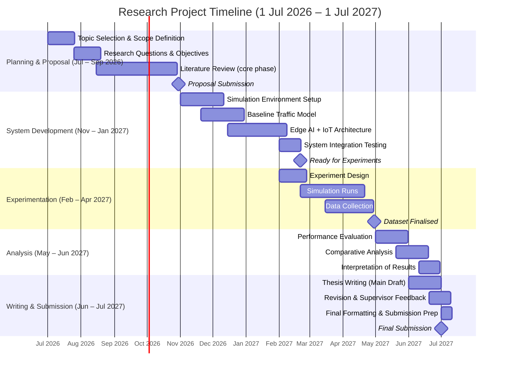

```mermaid
gantt
    title Research Project Timeline (1 Jul 2026 – 1 Jul 2027)
    dateFormat YYYY-MM-DD
    axisFormat %b %Y

    section Planning & Proposal (Jul – Sep 2026)

    Topic Selection & Scope Definition     :p1, 2026-07-01, 25d
    Research Questions & Objectives        :p2, 2026-07-25, 25d
    Literature Review (core phase)         :p3, 2026-08-15, 75d
    Proposal Submission                    :milestone, m1, 2026-10-30, 0d

    section System Development (Nov – Jan 2027)

    Simulation Environment Setup           :p4, 2026-11-01, 40d
    Baseline Traffic Model                 :p5, 2026-11-20, 40d
    Edge AI + IoT Architecture             :p6, 2026-12-15, 55d
    System Integration Testing             :p7, 2027-02-01, 20d
    Ready for Experiments                  :milestone, m2, 2027-02-20, 0d

    section Experimentation (Feb – Apr 2027)

    Experiment Design                      :p8, 2027-02-01, 25d
    Simulation Runs                        :p9, 2027-02-20, 60d
    Data Collection                        :p10, 2027-03-15, 45d
    Dataset Finalised                      :milestone, m3, 2027-04-30, 0d

    section Analysis (May – Jun 2027)

    Performance Evaluation                 :p11, 2027-05-01, 30d
    Comparative Analysis                   :p12, 2027-05-20, 30d
    Interpretation of Results              :p13, 2027-06-10, 20d

    section Writing & Submission (Jun – Jul 2027)

    Thesis Writing (Main Draft)            :p14, 2027-06-01, 30d
    Revision & Supervisor Feedback         :p15, 2027-06-20, 20d
    Final Formatting & Submission Prep     :p16, 2027-07-01, 10d
    Final Submission                      :milestone, final, 2027-07-01, 0d
```
