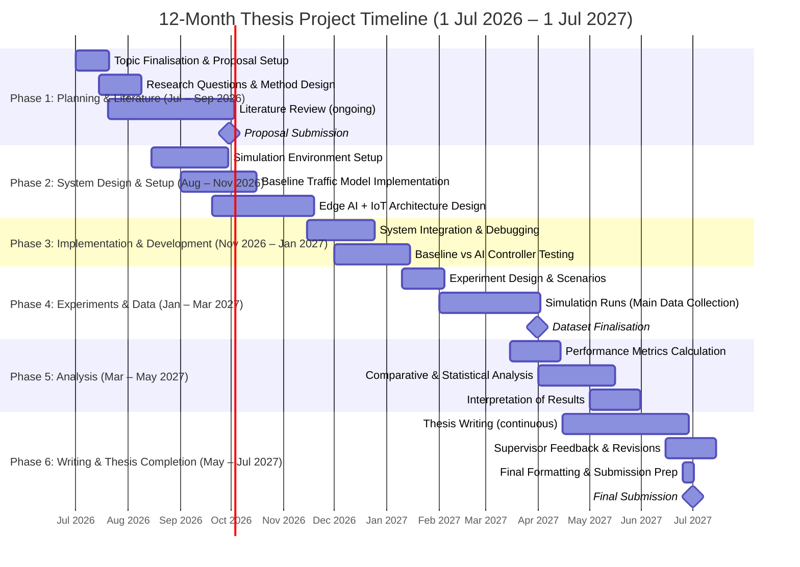

```mermaid
gantt
    title 12-Month Thesis Project Timeline (1 Jul 2026 – 1 Jul 2027)
    dateFormat YYYY-MM-DD
    axisFormat %b %Y

    section Phase 1: Planning & Literature (Jul – Sep 2026)

    Topic Finalisation & Proposal Setup     :p1, 2026-07-01, 20d
    Research Questions & Method Design      :p2, 2026-07-15, 25d
    Literature Review (ongoing)             :p3, 2026-07-20, 75d

    Proposal Submission                     :milestone, m1, 2026-09-30, 0d


    section Phase 2: System Design & Setup (Aug – Nov 2026)

    Simulation Environment Setup            :p4, 2026-08-15, 45d
    Baseline Traffic Model Implementation    :p5, 2026-09-01, 45d
    Edge AI + IoT Architecture Design       :p6, 2026-09-20, 60d


    section Phase 3: Implementation & Development (Nov 2026 – Jan 2027)

    System Integration & Debugging          :p7, 2026-11-15, 40d
    Baseline vs AI Controller Testing       :p8, 2026-12-01, 45d


    section Phase 4: Experiments & Data (Jan – Mar 2027)

    Experiment Design & Scenarios           :p9, 2027-01-10, 25d
    Simulation Runs (Main Data Collection)  :p10, 2027-02-01, 60d

    Dataset Finalisation                    :milestone, m2, 2027-03-31, 0d


    section Phase 5: Analysis (Mar – May 2027)

    Performance Metrics Calculation         :p11, 2027-03-15, 30d
    Comparative & Statistical Analysis      :p12, 2027-04-01, 45d
    Interpretation of Results               :p13, 2027-05-01, 30d


    section Phase 6: Writing & Thesis Completion (May – Jul 2027)

    Thesis Writing (continuous)             :p14, 2027-04-15, 75d
    Supervisor Feedback & Revisions         :p15, 2027-06-15, 30d
    Final Formatting & Submission Prep      :p16, 2027-06-25, 7d

    Final Submission                        :milestone, final, 2027-07-01, 0d
```
