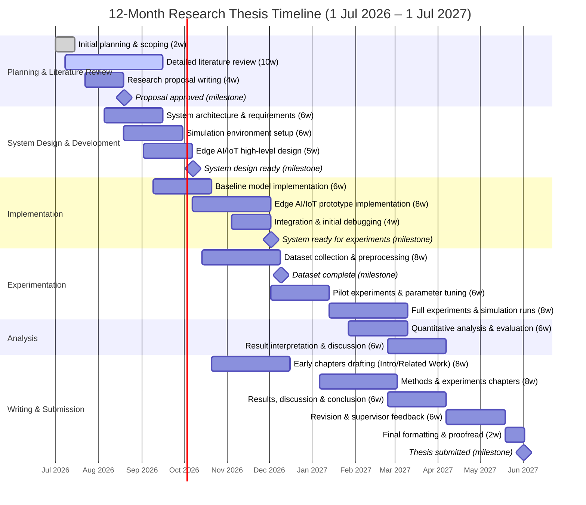

```mermaid
gantt
    title 12-Month Research Thesis Timeline (1 Jul 2026 – 1 Jul 2027)
    dateFormat  YYYY-MM-DD
    axisFormat  %b %Y

    %% ------------------------
    %% Planning & Literature Review
    %% ------------------------
    section Planning & Literature Review
    Initial planning & scoping (2w)          :done, plan1, 2026-07-01, 2w
    Detailed literature review (10w)         :active, lit1, 2026-07-08, 10w
    Research proposal writing (4w)           :prop1, 2026-07-22, 4w
    Proposal approved (milestone)            :milestone, m_proposal, 2026-08-19, 1d

    %% ------------------------
    %% System Design & Development
    %% ------------------------
    section System Design & Development
    System architecture & requirements (6w)  :arch1, 2026-08-05, 6w
    Simulation environment setup (6w)        :sim1, 2026-08-19, 6w
    Edge AI/IoT high-level design (5w)       :design_edge1, 2026-09-02, 5w
    System design ready (milestone)          :milestone, m_system_ready, 2026-10-07, 1d

    %% ------------------------
    %% Implementation
    %% ------------------------
    section Implementation
    Baseline model implementation (6w)       :impl_base, 2026-09-09, 6w
    Edge AI/IoT prototype implementation (8w):impl_edge, 2026-10-07, 8w
    Integration & initial debugging (4w)     :impl_int, 2026-11-04, 4w
    System ready for experiments (milestone) :milestone, m_impl_ready, 2026-12-02, 1d

    %% ------------------------
    %% Experimentation
    %% ------------------------
    section Experimentation
    Dataset collection & preprocessing (8w)  :data1, 2026-10-14, 8w
    Dataset complete (milestone)             :milestone, m_data_done, 2026-12-09, 1d
    Pilot experiments & parameter tuning (6w):exp1, 2026-12-02, 6w
    Full experiments & simulation runs (8w)  :exp2, 2027-01-13, 8w

    %% ------------------------
    %% Analysis
    %% ------------------------
    section Analysis
    Quantitative analysis & evaluation (6w)  :analysis1, 2027-01-27, 6w
    Result interpretation & discussion (6w)  :analysis2, 2027-02-24, 6w

    %% ------------------------
    %% Writing & Submission
    %% ------------------------
    section Writing & Submission
    Early chapters drafting (Intro/Related Work) (8w) :write1, 2026-10-21, 8w
    Methods & experiments chapters (8w)               :write2, 2027-01-06, 8w
    Results, discussion & conclusion (6w)             :write3, 2027-02-24, 6w
    Revision & supervisor feedback (6w)               :write4, 2027-04-07, 6w
    Final formatting & proofread (2w)                 :write5, 2027-05-19, 2w
    Thesis submitted (milestone)                      :milestone, m_submit, 2027-06-01, 1d
```
