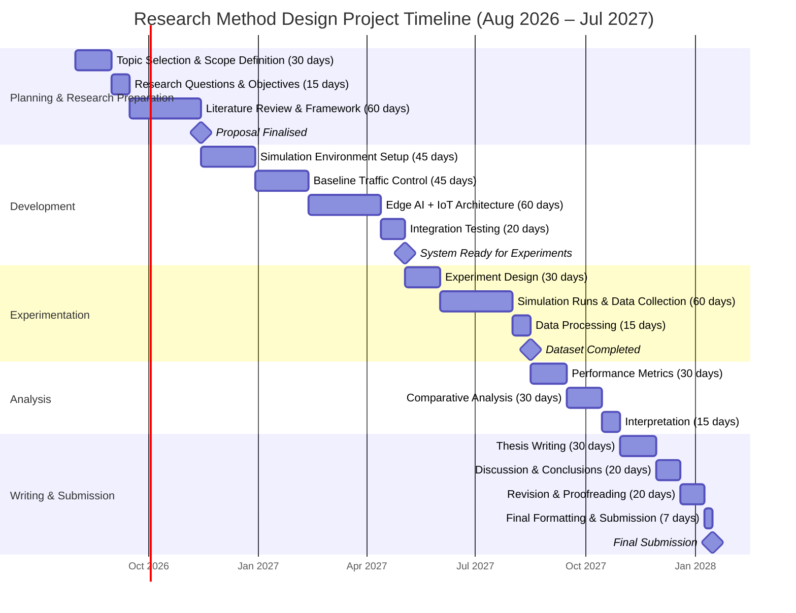

```mermaid
gantt
    title Research Method Design Project Timeline (Aug 2026 – Jul 2027)
    dateFormat YYYY-MM-DD
    axisFormat %b %Y

    section Planning & Research Preparation

    Topic Selection & Scope Definition (30 days) :p1, 2026-08-01, 30d
    Research Questions & Objectives (15 days)    :p2, after p1, 15d
    Literature Review & Framework (60 days)      :p3, after p2, 60d

    Proposal Finalised                           :milestone, m1, after p3, 0d

    section Development

    Simulation Environment Setup (45 days)       :p4, after m1, 45d
    Baseline Traffic Control (45 days)           :p5, after p4, 45d
    Edge AI + IoT Architecture (60 days)        :p6, after p5, 60d
    Integration Testing (20 days)                :p7, after p6, 20d

    System Ready for Experiments                :milestone, m2, after p7, 0d

    section Experimentation

    Experiment Design (30 days)                 :p8, after m2, 30d
    Simulation Runs & Data Collection (60 days) :p9, after p8, 60d
    Data Processing (15 days)                   :p10, after p9, 15d

    Dataset Completed                           :milestone, m3, after p10, 0d

    section Analysis

    Performance Metrics (30 days)              :p11, after m3, 30d
    Comparative Analysis (30 days)             :p12, after p11, 30d
    Interpretation (15 days)                   :p13, after p12, 15d

    section Writing & Submission

    Thesis Writing (30 days)                   :p14, after p13, 30d
    Discussion & Conclusions (20 days)         :p15, after p14, 20d
    Revision & Proofreading (20 days)          :p16, after p15, 20d
    Final Formatting & Submission (7 days)     :p17, after p16, 7d

    Final Submission                           :milestone, final, after p17, 0d
```
