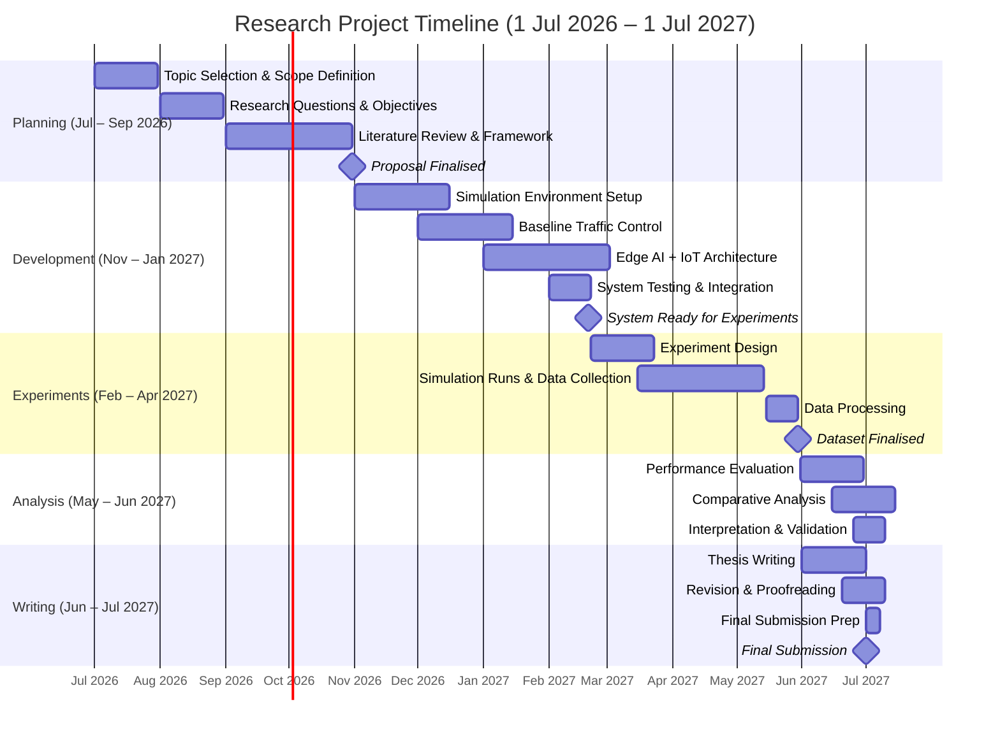

```mermaid
gantt
    title Research Project Timeline (1 Jul 2026 – 1 Jul 2027)
    dateFormat YYYY-MM-DD
    axisFormat %b %Y

    section Planning (Jul – Sep 2026)

    Topic Selection & Scope Definition   :p1, 2026-07-01, 30d
    Research Questions & Objectives      :p2, 2026-08-01, 30d
    Literature Review & Framework        :p3, 2026-09-01, 60d
    Proposal Finalised                  :milestone, m1, 2026-10-31, 0d

    section Development (Nov – Jan 2027)

    Simulation Environment Setup         :p4, 2026-11-01, 45d
    Baseline Traffic Control             :p5, 2026-12-01, 45d
    Edge AI + IoT Architecture           :p6, 2027-01-01, 60d
    System Testing & Integration         :p7, 2027-02-01, 20d
    System Ready for Experiments         :milestone, m2, 2027-02-20, 0d

    section Experiments (Feb – Apr 2027)

    Experiment Design                    :p8, 2027-02-21, 30d
    Simulation Runs & Data Collection    :p9, 2027-03-15, 60d
    Data Processing                     :p10, 2027-05-15, 15d
    Dataset Finalised                   :milestone, m3, 2027-05-30, 0d

    section Analysis (May – Jun 2027)

    Performance Evaluation               :p11, 2027-05-31, 30d
    Comparative Analysis                 :p12, 2027-06-15, 30d
    Interpretation & Validation          :p13, 2027-06-25, 15d

    section Writing (Jun – Jul 2027)

    Thesis Writing                       :p14, 2027-06-01, 30d
    Revision & Proofreading              :p15, 2027-06-20, 20d
    Final Submission Prep                :p16, 2027-07-01, 7d
    Final Submission                    :milestone, final, 2027-07-01, 0d
```
