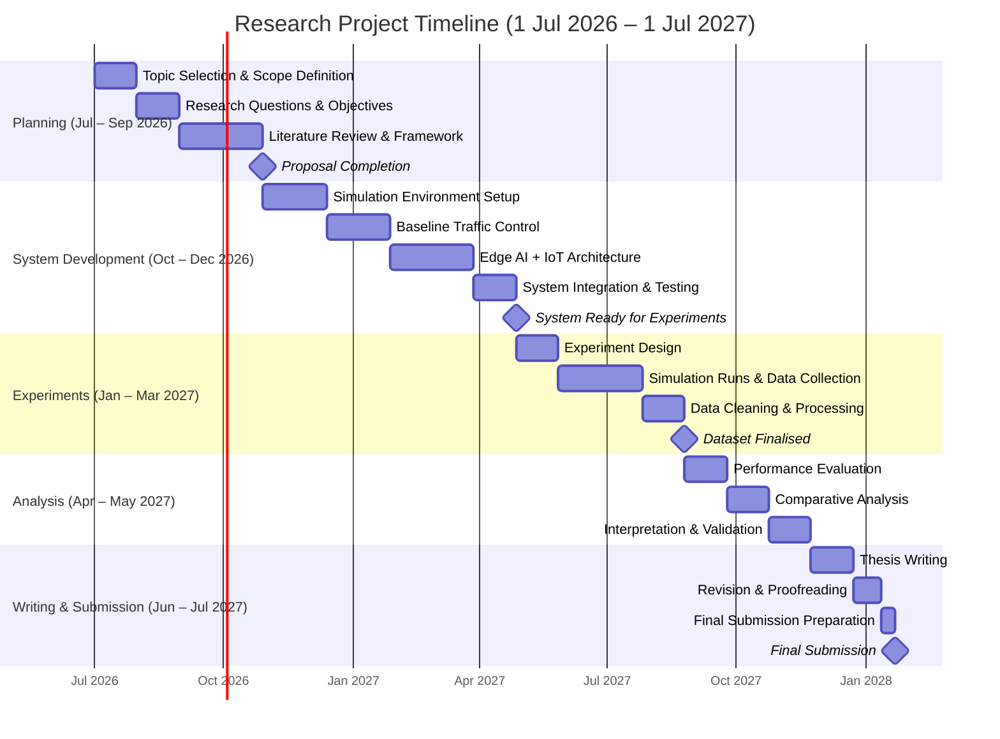

```mermaid
gantt
    title Research Project Timeline (1 Jul 2026 – 1 Jul 2027)
    dateFormat YYYY-MM-DD
    axisFormat %b %Y

    section Planning (Jul – Sep 2026)

    Topic Selection & Scope Definition   :p1, 2026-07-01, 30d
    Research Questions & Objectives      :p2, after p1, 30d
    Literature Review & Framework        :p3, after p2, 60d
    Proposal Completion                  :milestone, m1, after p3, 0d

    section System Development (Oct – Dec 2026)

    Simulation Environment Setup         :p4, after m1, 45d
    Baseline Traffic Control             :p5, after p4, 45d
    Edge AI + IoT Architecture           :p6, after p5, 60d
    System Integration & Testing         :p7, after p6, 30d
    System Ready for Experiments         :milestone, m2, after p7, 0d

    section Experiments (Jan – Mar 2027)

    Experiment Design                    :p8, after m2, 30d
    Simulation Runs & Data Collection    :p9, after p8, 60d
    Data Cleaning & Processing           :p10, after p9, 30d
    Dataset Finalised                    :milestone, m3, after p10, 0d

    section Analysis (Apr – May 2027)

    Performance Evaluation               :p11, after m3, 30d
    Comparative Analysis                 :p12, after p11, 30d
    Interpretation & Validation          :p13, after p12, 30d

    section Writing & Submission (Jun – Jul 2027)

    Thesis Writing                       :p14, after p13, 30d
    Revision & Proofreading              :p15, after p14, 20d
    Final Submission Preparation         :p16, after p15, 10d
    Final Submission                    :milestone, final, after p16, 0d
```
